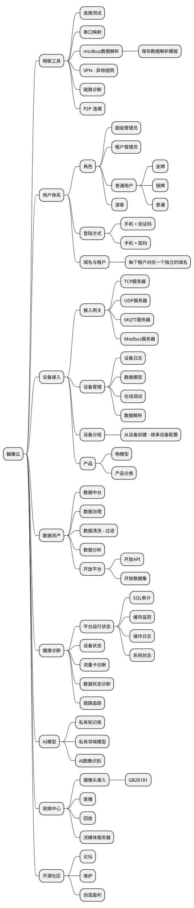

# 平台架构

翰臻云平台支持与接入设备进行通信，可将设备通信数据通过多种存储策略进行存储和处理，是构建物联网应用的基础。本文介平台的系统架构。

1. **设备连接层**：支持MQTT、TCP、UDP、HTTP、WebSocket协议，提供统一设备接入的能力，确保各种类型的设备能够无缝接入平台。同时，该层还支持设备连接状态的实时监控，保障设备连接的稳定性和可靠性。

2. **设备管理层**：提供设备注册、配置、维护和监控的功能，支持设备属性、状态实时展示和历史属性、设备日志记录查询等。用户可以通过该层对设备进行批量管理、远程升级和故障诊断，提升设备运维效率。

3. **数据治理层**：负责数据的采集、存储、清洗、转换和分析，确保数据的质量和一致性。该层提供强大的数据处理能力，包括实时数据流处理和批量数据处理，支持数据的多维度分析和深度挖掘，帮助用户从数据中获取有价值的洞察。

4. **AI模型层**：集成多种AI算法和机器学习模型，支持数据训练、模型部署和在线推理。用户可以通过该层实现智能预测、异常检测、模式识别等功能，提升物联网系统的智能化水平。

5. **业务逻辑层**：提供规则引擎、数据转发和数据解析等功能，支持多种业务场景下的数据处理和交互操作。用户可以通过配置业务规则，实现事件驱动的自动化操作，提升业务响应速度和效率。

6. **应用开发层**：提供REST
   API和WebSocket接口，支持前端对接和自定义应用开发。同时，还提供了可视化的数据展示和操作页面，方便用户快速搭建物联网应用系统。用户可以通过该层开发定制化应用，满足特定业务需求，实现数据的直观展示和交互操作。

## 架构图

