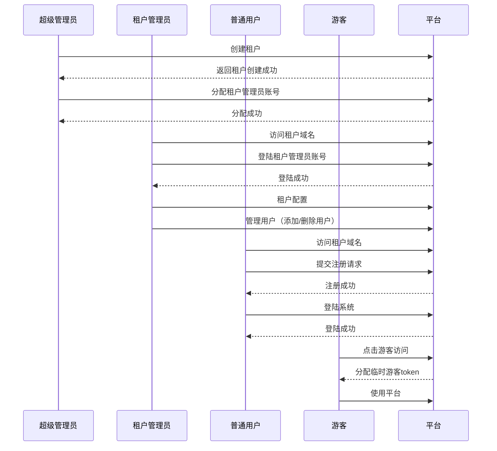

# 用户体系

## 背景
本项目旨在实现一个多租户的物联网系统，支持不同角色和权限的用户管理。系统通过不同域名区分租户，支持多种登陆方式和多种用户等级。

## 用户体系设计

### 角色
- **超级管理员**
  - 拥有系统的全部管理权限，包括管理租户和配置系统。
  - 账号全平台唯一，租户之间不可重复

- **租户管理员**
  - 拥有独立的域名，通过域名区分租户。
  - 账号可同时存在于多个租户。
  - 可以管理租户内的用户（如移除、添加用户）。
  - 可以配置租户信息（如公司名称、公司简介等）。

- **普通用户**
  - 账号可以存在于多个租户，通过域名确定登陆的租户系统。
  - 分为不同的等级：金牌、银牌、普通，拥有不同的权限。

- **游客**
  - 分配临时游客token。
  - 可以进行有限的操作。

### 登陆方式
- **手机 + 验证码登陆**
- **手机 + 密码登陆**

### 域名与租户
- 每个租户对应一个独立的域名，通过域名确定登陆的租户系统。

## 主要操作流程
